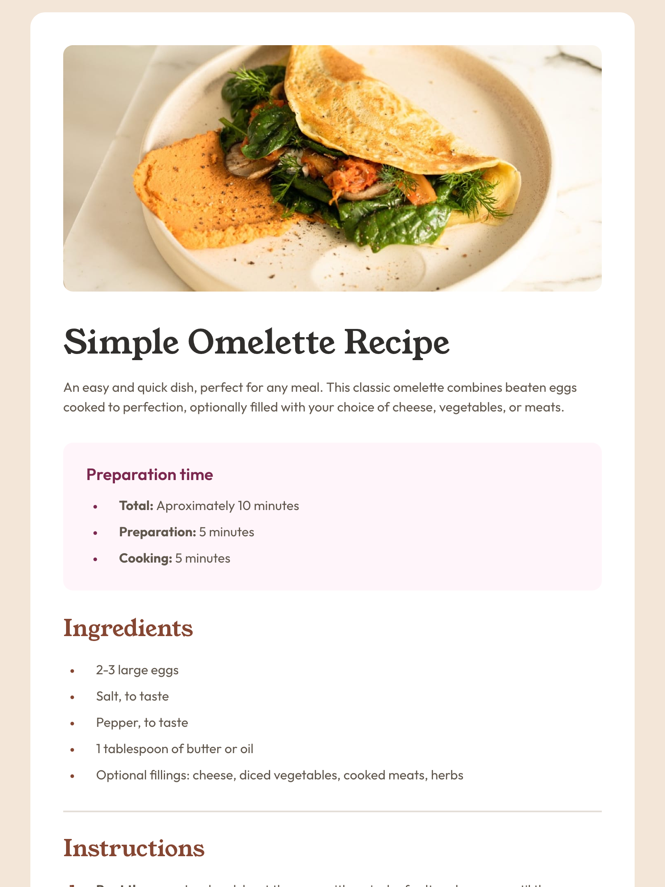

# Frontend Mentor - Recipe page solution

This is a solution to the [Recipe page challenge on Frontend Mentor](https://www.frontendmentor.io/challenges/recipe-page-KiTsR8QQKm). Frontend Mentor challenges help you improve your coding skills by building realistic projects.

## Table of contents

- [Overview](#overview)
  - [The challenge](#the-challenge)
  - [Screenshot](#screenshot)
  - [Links](#links)
- [Process](#process)
  - [Built with](#built-with)
  - [Technology stack](#technology-stack)
  - [Useful resources](#useful-resources)
- [Author](#author)

## Overview

### Screenshot

### Links

- Solution URL: [GitHub repository](https://github.com/justinconnell/fm-recipe-page)
- Live Site URL: [Live site](https://justinconnell.github.io/fm-recipe-page/)

## Process

### Built with

- Semantic HTML5 markup
- Vanilla JS
- Flexbox
- CSS3
- Mobile-first workflow

### Technology stack

The Vanilla JS using simple web components provide tha ability to separate the the solution into smaller modules that address specific parts of the problem domain.

### Useful resources

- [Vanilla JS: You Might Not Need a Framework](https://frontendmasters.com/courses/vanilla-js-apps/) - This course helped me to understand the basic principles behind structuring and implementing a solution that uses Vanilla JS and web components.

## Author

- GitHub - [Justin](https://github.com/justinconnell)
- Frontend Mentor - [@justinconnell](https://www.frontendmentor.io/profile/justinconnell)
- Twitter - [@justin2code](https://twitter.com/justin2code)
